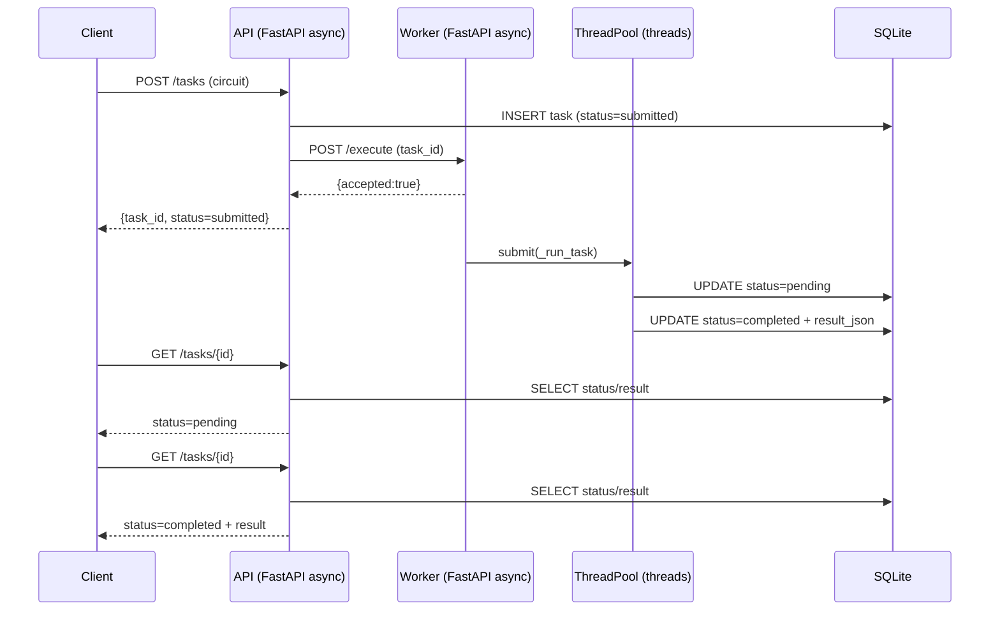

# QuantumTask ⚛️

A minimal distributed quantum circuit execution service built with FastAPI, Docker, and Qiskit, demonstrating asynchronous request handling and background task execution via threading.

QuantumTask is a minimal distributed service for executing OpenQASM 3 quantum circuits using Qiskit’s Aer simulator.

Clients submit a circuit to the API and immediately receive a task ID. Execution happens asynchronously in a separate Worker service, and clients poll for status and results.

## Table of Contents

- [Getting Started](#getting-started)
- [Using the API](#using-the-api)
- [Architecture](#architecture)
- [Design Decisions](#design-decisions)
- [Deliverables](#deliverables)
- [Resources & References](#resources--references)

## Getting Started

### 1. Prerequisites

- Docker
- Docker Compose
- (Optional) Python environment with `pytest` and `httpx` for running tests locally

### 2. Start the Services

From the project root:

```bash
docker compose up --build
```

The API will be available at:

http://localhost:8000

Swagger documentation:

http://localhost:8000/docs

To stop the services:

```bash
docker compose down
```

### 3. Run Tests

With the services running:

```bash
pytest -q
```

Note: Tests run outside Docker and require a local Python environment with `pytest` and `httpx` installed.

## Using the API

### Submit a Task

Send a POST request to `/tasks` with a serialized OpenQASM 3 circuit:

```bash
curl -X POST http://localhost:8000/tasks \
  -H "Content-Type: application/json" \
  -d '{"circuit": "OPENQASM 3.0; ..."}'
```

Response:

```json
{
  "task_id": "uuid",
  "status": "submitted"
}
```

Execution begins asynchronously in the Worker service.

### Retrieve Task Status

```bash
curl http://localhost:8000/tasks/<task_id>
```

Possible responses:

Pending:

```json
{
  "task_id": "...",
  "status": "pending"
}
```

Completed:

```json
{
  "task_id": "...",
  "status": "completed",
  "result": { ... }
}
```

Failed:

```json
{
  "task_id": "...",
  "status": "failed",
  "error": "..."
}
```

## Architecture

The system consists of two services:

- API (FastAPI)
- Worker (FastAPI + ThreadPoolExecutor)

Both share a mounted SQLite database.

Project structure:

```
.
├── api/
│   └── main.py
├── worker/
│   └── main.py
├── shared/
│   └── db.py
├── tests/
│   ├── test_errors.py
│   └── test_async_behavior.py
├── docker-compose.yml
└── README.md
```

### High-Level Flow

1. Client submits circuit to API (`POST /tasks`)
2. API:
   - Validates input
   - Inserts task with status = "submitted"
   - Asynchronously notifies Worker
   - Returns task_id immediately
3. Worker:
   - Receives `/execute`
   - Submits task to ThreadPoolExecutor
   - Returns acknowledgment immediately
4. Background thread:
   - Marks task as "running"
   - Executes QASM circuit
   - Updates DB with result or failure
5. Client polls (`GET /tasks/{id}`)

### Concurrency Model

- Async is used only for HTTP I/O
- ThreadPoolExecutor handles blocking CPU execution
- SQLite acts as coordination layer



## Design Decisions

<details>
<summary><strong>Service Separation</strong></summary>

The API and Worker are separate services to clearly demonstrate:

- Non-blocking request handling
- Background execution isolation
- Inter-service communication via HTTP

This mirrors real microservice patterns.

</details>

<details>
<summary><strong>Async Usage</strong></summary>

Async is used only where appropriate:

- Reading HTTP request bodies
- Calling Worker service

CPU-bound Qiskit execution is not async and runs in threads instead.

</details>

<details>
<summary><strong>Threading</strong></summary>

The Worker uses a ThreadPoolExecutor with limited parallelism.

This:

- Prevents blocking the HTTP layer
- Controls resource usage
- Enables concurrent execution

</details>

<details>
<summary><strong>Database</strong></summary>

SQLite is used for simplicity and inspectability.

Task lifecycle states:

- submitted
- running
- completed
- failed

The database acts as the synchronization layer between services.

</details>

<details>
<summary><strong>Container Networking</strong></summary>

Services communicate via Docker internal DNS:

```
http://worker:8001
```

The Worker service is not exposed publicly; only the API is.

This reflects common internal-service communication patterns.

</details>

## Deliverables

This repository includes:

- Full Docker-based implementation
- API + Worker separation
- Deterministic task lifecycle management
- Integration tests covering:
  - Invalid input handling
  - Failure propagation
  - Background execution behavior
  - Concurrency validation
- This README with architectural explanation

## Resources & References

- FastAPI Documentation  
  https://fastapi.tiangolo.com/

- Qiskit Aer Simulator  
  https://qiskit.org/

- Python ThreadPoolExecutor  
  https://docs.python.org/3/library/concurrent.futures.html

- Docker Compose Networking  
  https://docs.docker.com/compose/networking/

These references guided the concurrency model, service separation, and execution architecture used in QuantumTask.