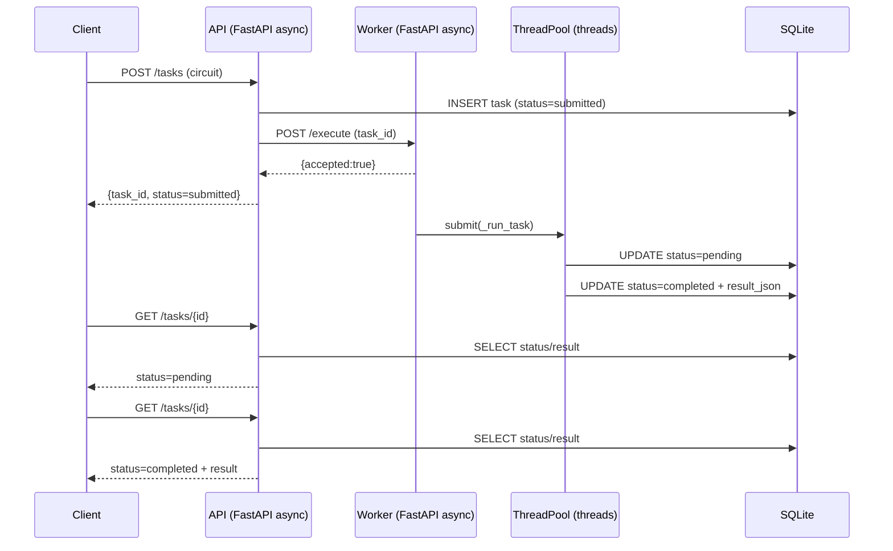

# quantum-task-executor

## Architecture Diagram

```mermaid
sequenceDiagram
  participant C as Client
  participant A as API (FastAPI async)
  participant W as Worker (FastAPI async)
  participant T as ThreadPool (threads)
  participant DB as SQLite

  C->>A: POST /tasks (circuit)
  A->>DB: INSERT task (status=submitted)
  A->>W: POST /execute (task_id)
  W-->>A: {accepted:true}
  A-->>C: {task_id, status=submitted}

  W->>T: submit(_run_task)
  T->>DB: UPDATE status=pending
  T->>DB: UPDATE status=completed + result_json

  C->>A: GET /tasks/{id}
  A->>DB: SELECT status/result
  A-->>C: status=pending

  C->>A: GET /tasks/{id}
  A->>DB: SELECT status/result
  A-->>C: status=completed + result
```